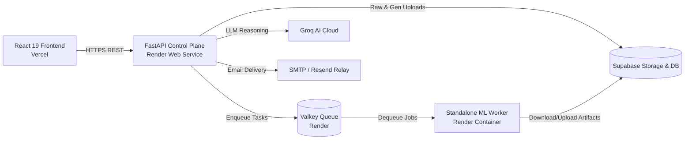
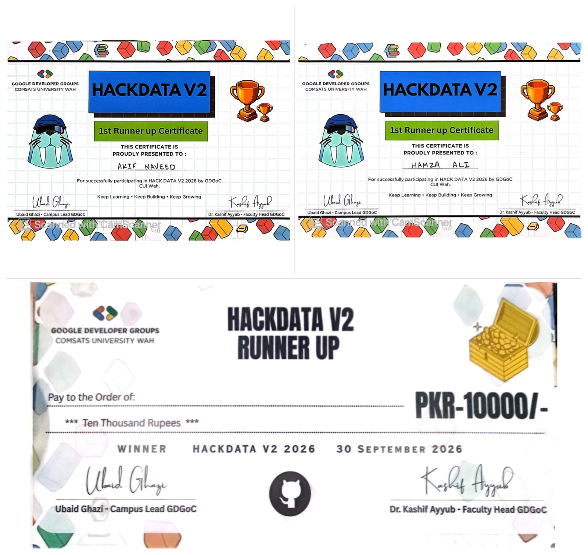

# HackData V2 — Schema-Aware Synthetic Data Platform

> **Production-grade, privacy-first, schema-aware synthetic data generation platform.**  
> Seamlessly synthesizes tabular data, complex multi-table relational databases, and reconciled business documents through state-of-the-art generative AI, deep neural networks (CTGAN/TVAE), and an intelligent natural-language control plane.

[](https://datavaultplatform.vercel.app)
[](https://hackdata-api.onrender.com/docs)
[](https://python.org)
[](https://react.dev)

---

## 🌐 Live Deployments

- **Frontend Application (Vercel):** [https://datavaultplatform.vercel.app](https://datavaultplatform.vercel.app)
- **Backend API (Render):** [https://hackdata-api.onrender.com](https://hackdata-api.onrender.com)
- **Interactive API Documentation:** [https://hackdata-api.onrender.com/docs](https://hackdata-api.onrender.com/docs)
- **Standalone ML Worker:** Render Cloud Worker Process (Valkey Queue Consumer)
- **Cloud Persistence:** Supabase PostgreSQL + Supabase Object Storage

---

## 🚀 Key Features & Innovations

### 1. Natural-Language Synthetic Data Control Plane
- Describe desired datasets in **natural English, Urdu, or Roman Urdu** (e.g., *"Generate 5,000 retail records for a Pakistani e-commerce store with Karachi and Lahore customers"*).
- Intelligent AI orchestrator parses unstructured intent into an immutable **Generation Specification** with explicit column types, foreign key relationships, value bounds, and categorical distributions.
- **Provenance Tracking:** Distinguishes between explicit user constraints, inferred domain rules, and system defaults.
- Live conversational refinement and clarification loop before any compute is spent.

### 2. Multi-Engine Hybrid Generative Architecture
- **SDV CTGAN & TVAE:** Deep generative models tailored for complex tabular correlations and continuous distributions.
- **Statistical Baseline Adapter:** High-speed distribution-matching synthesizer with KDE and empirical probability mass functions.
- **OOM Safety Guardrail:** Intelligently inspects row counts and categorical cardinality to automatically route high-cardinality workloads to memory-safe engines, protecting cloud resources from out-of-memory crashes.
- **Deterministic Fallback Engine:** Guarantees zero-failure generation under extreme resource limits or cold starts.

### 3. Comprehensive Modality Support
- **Tabular Data:** Single-table datasets with fine-grained schema inference, distribution fitting, and outlier control.
- **Relational Databases:** Multi-table schemas (e.g., Customers, Orders, Invoices, Payments) synthesized with strict referential integrity and topologically sorted foreign keys.
- **Complex Financial Documents:**
  - **Invoices:** Line items, VAT/sales tax calculations, dynamic billing details, and subtotal-to-grand-total reconciliation.
  - **Bank Statements:** Running balance reconciliation, double-entry consistency, and debit/credit sequence audits.

### 4. Synthia — Real-Time Voice & Chat Assistant
- Floating multimodal conversational co-pilot powered by Groq (Qwen/Llama).
- Supports real-time browser speech recognition (Web Speech API) and text chat.
- Context-aware assistance: analyzes active datasets, proposes schema transformations, adds synthetic columns, and executes actions with one-click user confirmations.

### 5. Enterprise Privacy, Compliance & Safety
- **Differential Privacy (DP):** Laplace and Gaussian noise injection with configurable privacy budget ($\epsilon$).
- **Pseudonymization & Masking:** Automated PII detection (emails, phone numbers, credit cards, national IDs) with reversible hashing or irreversible synthetic replacements.
- **Zero Raw Data Leakage:** Ensures generated synthetic records do not replicate authentic sensitive inputs.

### 6. Rigorous Evaluation & Diagnostic Suite
- **TSTR (Train on Synthetic, Test on Real):** Evaluates downstream ML utility by training predictive models on synthetic outputs and evaluating accuracy on real holdout test sets.
- **Statistical Drift & KS-Tests:** Kolmorogov-Smirnov and Chi-Square tests to verify marginal distribution fidelity.
- **Constraint Satisfaction Audits:** Real-time ledger tracking every business rule, primary key uniqueness check, and non-null constraint.

### 7. Instant Multi-Format Export & Email Delivery
- One-click downloads in **CSV**, **JSON**, and **SQL DDL/DML** formats.
- **Direct Email Dispatch:** Sends generated datasets as email attachments directly to destination inboxes via SMTP with multi-port SSL/STARTTLS fallback and HTTP API support.

---

## 📐 Architecture & Diagrams

Comprehensive architectural diagrams (High-Level Architecture, Low-Level Components, NL Generation Flow, and Distributed Job Pipeline) are documented in [`docs/architecture-diagram.md`](docs/architecture-diagram.md).



---

## 🛠️ Technology Stack

| Layer | Technologies |
|---|---|
| **Frontend** | React 19, TypeScript, Tailwind CSS, Lucide Icons, Vite, Agentation |
| **Backend API** | Python 3.11+, FastAPI, Pydantic v2, Uvicorn |
| **ML & Synthesis** | SDV (Synthetic Data Vault), CTGAN, TVAE, PyTorch, Scikit-learn, Pandas, NumPy |
| **AI Orchestration** | Groq Cloud (Qwen 3.8 27B / Llama 3.3 70B), Custom Prompt Chains |
| **Queue & Cache** | Valkey (Redis-compatible) on Render |
| **Cloud Storage & DB** | Supabase (PostgreSQL, Row-Level Security, S3 Object Storage) |
| **Deployment** | Vercel (Frontend), Render (API & Background Worker), Docker |

---

## 💻 Local Development Setup

### Prerequisites
- Python 3.11+
- Node.js 18+ and npm
- Git

### 1. Clone the Repository
```bash
git clone https://github.com/AkifNaveed12/Schema-aware-synthetic-data-platform.git
cd Schema-aware-synthetic-data-platform
```

### 2. Backend Setup
```bash
# Create virtual environment
python -m venv .venv
# Activate on Windows:
.venv\Scripts\activate
# Activate on macOS/Linux:
# source .venv/bin/activate

# Install dependencies
pip install -r backend/requirements.txt

# Start backend server (runs on port 8000)
python -m uvicorn backend.app.main:app --host 0.0.0.0 --port 8000 --reload
```

### 3. Frontend Setup
```bash
cd frontend

# Install packages
npm install

# Start Vite development server (runs on port 5173)
npm run dev
```

Visit `http://localhost:5173` to explore HackData V2 locally.

### 4. Running the Test Suite
```bash
# Run complete backend pytest suite (78 tests)
python -m pytest backend/tests/ -v
```

---

## 📄 License
This project is licensed under the MIT License.

---

## 👥 Team & Contributions

### **Muhammad Akif Naveed**

**Contributions:**
- Backend
- AI
- Integration
- Deployment
- Multi-Agent Orchestration setup
- System Design
- Architecture
- Project Planning and Idea Research

**Socials:**
- **LinkedIn:** [https://www.linkedin.com/in/akif-naveed-malik30](https://www.linkedin.com/in/akif-naveed-malik30)
- **GitHub:** [https://github.com/AkifNaveed12](https://github.com/AkifNaveed12)
- **Portfolio:** [https://portfolio-muhammad-akif-naveed.vercel.app/](https://portfolio-muhammad-akif-naveed.vercel.app/)

---

### **Hamza Ali**

**Contributions:**
- Frontend
- UI/UX Designing
- Security
- Quality Assurance
- System Testing

**Socials:**
- **LinkedIn:** [https://www.linkedin.com/in/hamza-ali-k712/](https://www.linkedin.com/in/hamza-ali-k712/)
- **GitHub:** [https://github.com/hamzaali-712](https://github.com/hamzaali-712)
- **Portfolio:** [https://personal-portfolio-beta-ten-54.vercel.app/](https://personal-portfolio-beta-ten-54.vercel.app/)

---

## 🏆 Achievement


