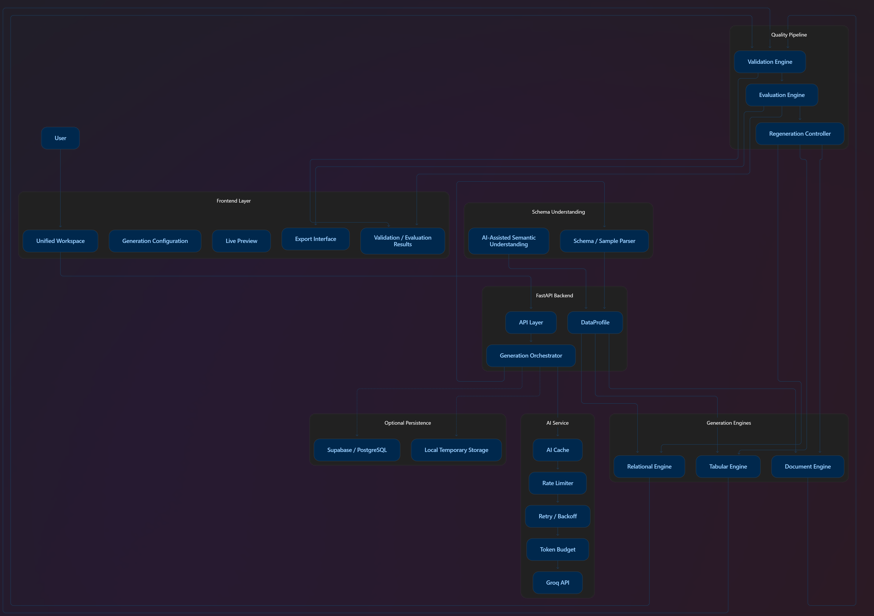

# HACKDATA V2 — SYSTEM ARCHITECTURE

> **Project:** HackData V2  
> **Official Theme:** Synthetic Data Platform  
> **Architecture Principle:** Schema-aware, modular, quality-first synthetic data generation.  
> **Execution Strategy:** Localhost-first with optional deployment after MVP stability.  
> **Status:** Finalized Architecture Baseline

---

## 1. Architectural Overview

HackData V2 follows a modular architecture built around a unified schema-aware synthetic-data pipeline.

The system consists of:

1. Frontend application
2. FastAPI backend
3. Schema understanding layer
4. Central `DataProfile`
5. Specialized generation engines
6. Validation engine
7. Quality evaluation engine
8. AI service layer
9. Export engine
10. Optional persistence layer

The core architecture is:

```text
User
  ↓
Frontend
  ↓
FastAPI API
  ↓
Orchestrator
  ↓
Schema Understanding
  ↓
DataProfile
  ↓
┌──────────────┬───────────────┬────────────────────┐
│              │               │                    │
▼              ▼               ▼                    ▼
Tabular      Relational      Document          Future Engines
Engine         Engine         Engine
│              │               │
└──────────────┴───────────────┘
               ↓
        Validation Engine
               ↓
        Evaluation Engine
               ↓
        ┌──────┴──────┐
        │             │
      PASS           FAIL
        │             │
        ▼             ▼
     Export       Regenerate
```

The architecture is designed so that AI provides semantic intelligence while deterministic/statistical engines handle bulk data generation and critical business logic.

## 2. Core Architectural Principles

2.1 Schema-Aware Generation

The system must understand the structure and semantics of the requested data before generation.

The pipeline must not behave as a simple random-data generator.

2.2 Specialized Generation Engines

Different data modalities require different generation strategies.

The system therefore separates:

Tabular generation
Relational generation
Document generation

Each engine is independently testable and replaceable.

2.3 AI as a Cross-Cutting Intelligence Layer

AI is not the primary bulk-data generator.

AI assists with:

Schema understanding
Semantic type inference
Relationship interpretation
Natural-language query interpretation
Realistic semantic content
Edge-case proposals
Document semantics

Bulk generation remains primarily local and deterministic/statistical.

2.4 Validation Before Export

Generated data must pass mandatory validation before it becomes exportable.

Generate
↓
Validate
↓
Evaluate
↓
PASS → Export

FAIL
↓
Adjust / Regenerate
2.5 Quality Over Superficial Breadth

The architecture prioritizes:

Correctness
↓
Fidelity
↓
Structural Integrity
↓
Privacy
↓
Business Correctness
↓
Performance
↓
Breadth

Additional modalities must not compromise the reliability of the core system.

## 3. System Topology



## 4. Frontend Architecture

4.1 Frontend Responsibilities

The frontend is responsible for:

User interaction
Dataset/schema configuration
Generation controls
Preview rendering
Validation results
Evaluation results
Regeneration controls
Export controls
Job progress
Error presentation

The frontend must not implement core generation or validation logic.

4.2 Frontend Technology

The implementation may use the team's selected React/Next.js stack.

The exact frontend framework and component system are implementation decisions and are not treated as requirements of the synthetic-data engine.

4.3 Workspace Experience

The application should provide a unified workspace for:

Tabular
Relational
Documents

The workspace should allow users to:

Configure generation
Preview generated data
Inspect validation/evaluation
Regenerate when required
Export validated results

The visual layout remains under frontend ownership.

4.4 Preview Strategy

The frontend must not trigger full dataset generation whenever a configuration value changes.

Preview requests should:

Generate a small sample
Use lightweight processing
Avoid unnecessary LLM calls
Use debouncing where appropriate
Reuse cached information where possible

## 5. Backend Architecture

5.1 FastAPI API Layer

FastAPI provides the HTTP interface between the frontend and backend services.

Responsibilities include:

Request validation
Authentication/security boundaries where applicable
Routing
Error handling
Request IDs
Job creation
Response serialization

Generation logic must remain outside route handlers.

5.2 Generation Orchestrator

The orchestrator coordinates the complete generation lifecycle.

Conceptually:

Request
↓
Validate Input
↓
Load / Create DataProfile
↓
Select Generation Engine
↓
Generate
↓
Validate
↓
Evaluate
↓
PASS / FAIL

The orchestrator must not contain modality-specific generation algorithms.

## 6. DataProfile

DataProfile is the central internal representation connecting schema understanding with generation.

6.1 DataProfile Structure
DataProfile
├── modality
├── schema
├── tables
├── columns
├── data types
├── semantic types
├── formats
├── distributions
├── correlations
├── relationships
├── constraints
├── privacy configuration
├── generation configuration
└── evaluation configuration
6.2 DataProfile Responsibilities

The DataProfile must allow the system to:

Normalize input information
Reuse schema analysis
Select generation strategies
Preserve relationships
Configure validation
Configure evaluation
Support deterministic regeneration
Avoid repeated AI calls

## 7. Schema Understanding Layer

7.1 Input Sources

The schema understanding layer may process:

Schema definitions
SQL DDL
JSON Schema
CSV samples
JSON samples
User-defined configuration
7.2 Deterministic Schema Analysis

Traditional parsing should be used wherever possible for:

Column names
Data types
Table names
Primary keys
Foreign keys
Basic constraints
File structure
7.3 AI-Assisted Understanding

AI may be used for information that requires semantic interpretation, such as:

customer_name → full name
email_address → email
monthly_income → currency
company_description → business text

AI output must be converted into structured DataProfile information.

## 8. Tabular Generation Engine

8.1 Responsibilities

The tabular engine generates synthetic single-table datasets.

It must support applicable:

Numeric distributions
Categorical distributions
Dates
Strings
Missing values
Outliers
Semantic fields
Random seeds
Privacy transformations
8.2 Generation Strategy

The exact synthetic-data algorithm must be selected according to dataset characteristics.

Potential approaches may include:

Statistical sampling
Copula-based methods
Machine-learning-based synthetic generators
Faker-assisted semantic generation
Custom deterministic generators

No single algorithm should be assumed to be optimal for every dataset.

8.3 Bulk Generation

Bulk generation must run locally wherever practical.

LLMs must not be called once per generated row.

## 9. Relational Generation Engine

9.1 Responsibilities

The relational engine treats related tables as one coherent dataset.

It must preserve:

Primary keys
Foreign keys
Relationships
Cardinalities
Parent-child dependencies
Cross-table business rules
9.2 Dependency Graph

The engine should construct a dependency graph from table relationships.

Example:

Customers
↓
Orders
↓
Order Items

Parent records must be generated before dependent child records.

9.3 Relationship Support

The engine should support:

1:1
1:N
N:N through junction tables
9.4 Cross-Table Consistency

Business calculations must be deterministic.

Example:

# Order.total_amount

SUM(OrderItem.quantity × OrderItem.unit_price)

## 10. Document Generation Engine

10.1 Supported Core Documents

The initial document engine focuses on:

Invoices
Bank statements

Additional document types may be added later if time and quality permit.

10.2 Invoice Architecture

Invoice generation should separate:

Semantic Content +
Deterministic Calculations +
Document Template
↓
Invoice

Critical calculations must never depend solely on LLM output.

10.3 Invoice Calculations
line_amount
=
quantity × unit_price

# subtotal

Σ(line_amount)

# total

subtotal + tax - discount

All calculations must be validated.

10.4 Bank Statement Architecture

The bank statement engine generates:

Transactions
Merchant descriptions
Debits
Credits
Starting balance
Running balances
Ending balance

The running balance must be deterministic:

# current_balance

previous_balance

- credit

* debit

## 11. AI Service Architecture

11.1 Provider

The initial AI provider is Groq.

The provider must be accessed through a dedicated AI service abstraction.

Generation engines must not directly depend on Groq-specific APIs.

11.2 AI Service Responsibilities

The AI service manages:

Model selection
Prompt construction
Structured output
Request validation
Response parsing
Caching
Rate limiting
Retry/backoff
Token budgeting
Usage tracking
Error normalization
11.3 AI Tasks

The AI service may provide:

Schema Understanding

Infer semantic meaning from samples/schema.

Semantic Content

Generate realistic:

Names
Addresses
Companies
Descriptions
Free text
Query Interpretation

Convert natural-language requests into structured generation configuration.

Edge-Case Proposals

Suggest meaningful:

Nulls
Boundary values
Rare categories
Outliers
Domain-specific edge cases

## 12. LLM Efficiency Architecture

12.1 Caching

Equivalent AI requests should reuse cached responses.

Schema analysis is a primary caching candidate.

12.2 Request Deduplication

Equivalent simultaneous requests should be deduplicated where practical.

12.3 Rate Limiting

The AI service must implement application-level rate limiting.

This protects the application from excessive API usage and provider throttling.

12.4 Retry and Backoff

Transient provider failures should use:

Bounded Retries

- Exponential Backoff
- Optional Jitter

Infinite retry loops are prohibited.

12.5 Token Budget

AI requests should contain only the information required for the task.

The system must avoid sending:

Entire large datasets
Repeated schema information
Unnecessary context
Previously generated rows

## 13. Validation Architecture

Validation is a mandatory stage after generation.

13.1 Structural Validation

Check:

Schema conformity
Data types
Required fields
Primary keys
Foreign keys
Cardinality
Relationships
13.2 Mathematical Validation

Check:

Invoice totals
Taxes
Discounts
Order totals
Running balances
Other configured calculations
13.3 Statistical Validation

Where source/profile information exists, compare:

Numeric distributions
Categorical frequencies
Correlations
Missingness
Ranges
Outliers
13.4 Privacy Validation

Where source data is supplied, evaluate:

Exact record overlap
Sensitive value reuse
Identifier leakage
Suspicious memorization

## 14. Evaluation Architecture

The evaluation layer measures synthetic-data quality beyond basic schema validity.

14.1 Statistical Fidelity

Measures how closely generated data resembles the target statistical profile.

14.2 Structural Fidelity

Measures:

Relationship preservation
Referential integrity
Cardinality
Schema correctness
14.3 Business Fidelity

Measures whether domain-specific rules remain valid.

Examples:

Invoice totals
Bank balances
Order totals
Configured constraints
14.4 Utility Evaluation

Where feasible, support TSTR:

Synthetic Data
↓
Train Model
↓
Test on Real Data

Utility evaluation must only be performed when an appropriate evaluation dataset is available.

## 15. Regeneration Architecture

Failed validation/evaluation should trigger controlled regeneration.

Generation
↓
Validation
↓
Evaluation
↓
PASS ─────────────→ Export

FAIL
↓
Diagnose Failure
↓
Adjust Parameters
↓
Regenerate
↓
Validate Again
15.1 Regeneration Rules

The system must:

Identify the failure where possible
Adjust relevant parameters
Use a new seed where appropriate
Limit retry attempts
Prevent infinite regeneration loops

## 16. Job Architecture

Large generation/evaluation tasks should use background jobs.

16.1 Suitable Asynchronous Operations

Examples:

Large tabular generation
Large relational generation
Bulk document generation
Expensive evaluation
Large exports
16.2 Job Lifecycle
QUEUED
↓
RUNNING
↓
VALIDATING
↓
EVALUATING
↓
COMPLETED

Failure:

RUNNING
↓
FAILED
16.3 Job Isolation

Long-running workloads must not unnecessarily block the FastAPI request lifecycle.

## 17. Export Architecture

The export layer receives an already-generated and validated dataset.

Generation
↓
Validation
↓
Evaluation
↓
Validated Generation
↓
Export

The export layer must not silently regenerate data.

17.1 Supported Formats

Depending on modality:

CSV
JSON
SQL
PDF/document output
17.2 Export Validation

Before export, the system must verify:

Generation exists
Required validation passed
Format is supported
Dataset is complete
No internal metadata/secrets are exposed

## 18. Privacy & Security Architecture

18.1 Data Minimization

The system should process only the information required for generation and evaluation.

Large source datasets must not be unnecessarily sent to external AI services.

18.2 Temporary Input Handling

Uploaded files should use controlled temporary storage where necessary.

Temporary data should be cleaned up according to the configured lifecycle.

18.3 Column-Level Privacy

Supported mechanisms may include:

Masking
SHA-256 hashing
Synthetic replacement
Controlled numerical noise

Privacy transformations must not silently break required structural constraints.

18.4 API Secret Protection

Secrets must:

Remain server-side
Be loaded through environment variables
Never be committed to Git
Never be sent to the frontend

This includes:

Groq credentials
Supabase credentials
Deployment credentials
18.5 Input Security

The backend must validate:

Request bodies
File types
File sizes
File content
User-controlled configuration

Arbitrary filesystem paths must never be accepted from untrusted input.

## 19. Persistence Architecture

Persistence is optional for the core generation pipeline.

19.1 Local-First Operation

The MVP should work without requiring a cloud database for core synthetic-data generation.

19.2 Supabase

Supabase/PostgreSQL may be used for:

Presets
Saved schemas
Saved generation configurations
Optional project state

The generation engines must not depend on Supabase for basic local operation.

19.3 Temporary Data

Generated data may remain in memory or controlled temporary storage during the generation/export lifecycle.

## 20. Localhost-First Deployment Architecture

The primary MVP topology is:

Browser
↓
Local Frontend
↓
Local FastAPI
↓
Local Generation / Validation
↓
Local Compute
↓
Groq only when AI reasoning is required

The purpose of localhost-first execution is:

Faster experimentation
Greater control
Reduced deployment risk
Local compute utilization
Easier debugging
Reduced dependence on cloud infrastructure

## 21. Optional Cloud Deployment

Cloud deployment is not an MVP dependency.

If the MVP is stable and sufficient time remains:

Frontend → Vercel
Backend → Render

The architecture must remain deployment-compatible without hardcoding cloud-specific behavior into the generation engines.

## 22. Technology Stack

Layer Technology Purpose
Frontend React / Next.js User workspace and visualization
Backend Python / FastAPI API and orchestration
Data Processing Pandas / NumPy Data manipulation and numerical processing
Statistics SciPy / selected statistical libraries Distribution analysis and evaluation
Synthetic Generation Selected local/statistical generators Bulk synthetic data
Semantic Data Faker + AI where appropriate Realistic semantic values
AI Groq API Schema understanding and semantic intelligence
Validation Custom Python validation layer Structural/business validation
Evaluation Custom statistical/utility layer Fidelity/privacy/utility evaluation
Persistence Supabase/PostgreSQL (optional) Presets and saved state
Export CSV / JSON / SQL / PDF tooling Dataset/document export
Deployment Vercel + Render (optional) Post-MVP deployment

## 23. Backend Logical Structure

The backend should maintain clear separation of concerns.

A conceptual structure is:

backend/
└── app/
├── api/
│ └── routes/
│
├── models/
│ ├── requests/
│ └── responses/
│
├── core/
│ ├── config/
│ ├── errors/
│ └── logging/
│
├── schema/
│ ├── parser/
│ └── profiler/
│
├── engine/
│ ├── tabular/
│ ├── relational/
│ └── document/
│
├── validation/
│
├── evaluation/
│
├── ai/
│ ├── service/
│ ├── cache/
│ └── providers/
│
├── jobs/
│
├── export/
│
└── main.py

The exact folder structure may be adjusted during implementation if required, but the separation of responsibilities must remain.

## 24. End-to-End Data Flow

The canonical flow is:

1. User provides schema/sample/configuration
   ↓
2. FastAPI validates request
   ↓
3. Schema parser analyzes deterministic structure
   ↓
4. AI assists with semantic understanding if required
   ↓
5. DataProfile is created
   ↓
6. Appropriate generation engine is selected
   ↓
7. Local engine generates synthetic data
   ↓
8. Structural/business validation runs
   ↓
9. Statistical/privacy/utility evaluation runs
   ↓
10. PASS → generation becomes exportable
    ↓
11. FAIL → controlled regeneration
    ↓
12. Validated dataset is exported

## 25. Architectural Invariants

The following rules must always remain true:

Invariant 1

AI must not become the bulk-data generator.

Invariant 2

Critical arithmetic must be deterministic.

Invariant 3

Foreign keys must reference valid primary keys.

Invariant 4

Failed mandatory validation must prevent export.

Invariant 5

Frontend must not contain provider secrets.

Invariant 6

Large workloads must not unnecessarily block HTTP requests.

Invariant 7

Repeated AI requests should be cached or deduplicated where possible.

Invariant 8

The core MVP must operate locally.

Invariant 9

Generation engines must remain independent of the AI provider.

Invariant 10

Adding new modalities must not compromise the quality of existing modalities.

## 26. Architecture Success Criteria

The architecture is considered successfully implemented when:

Schema/sample input can become a DataProfile.
DataProfile can drive the appropriate generation engine.
Tabular data can be generated locally.
Relational data preserves relationships.
Documents preserve business calculations.
Validation catches structural/business failures.
Evaluation measures synthetic-data quality.
Failed outputs can be regenerated.
AI is used selectively.
Groq requests are cached and rate-limited.
Large jobs can execute asynchronously.
Validated data can be exported.
The entire MVP operates on localhost.
Optional cloud deployment does not require architectural rewrites.

## 27. Final Architecture Principle

HackData V2 is fundamentally:

A schema-aware, AI-assisted, multi-modal synthetic-data generation and evaluation platform.

The architecture must therefore optimize for:

UNDERSTAND
↓
PROFILE
↓
GENERATE
↓
VALIDATE
↓
EVALUATE
↓
REGENERATE IF REQUIRED
↓
EXPORT

The AI layer provides intelligence.

The specialized engines provide generation.

The validation/evaluation layers provide trust.

The API provides orchestration.

The frontend provides the user experience.

The complete system works locally first and can be deployed later without changing the core architecture.
