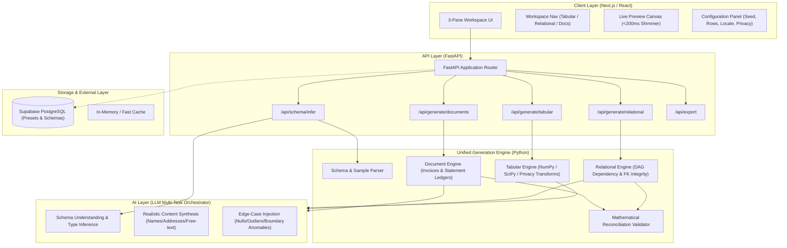

# HACKDATA V2 — SYSTEM ARCHITECTURE

> **Source Reference:** `theme.pdf` (Slide 4 System Design, Slide 3 Pipeline, Slide 9 AI Layer, Slide 11 Judging Criteria)  
> **Core Principle:** Simple, modular, schema-aware generation pipeline delivering sub-second preview latency and verified data integrity.

---

## 1. Architectural Overview & System Topology

The platform implements a modular architecture composed of a reactive **3-Pane Frontend** (Next.js/React), a high-performance **Synthetic Generation Backend** (Python/FastAPI), a unified **AI Semantic Layer** (LLM inference), and an optional **Supabase Persistence Layer**.



---

## 2. Component Subsystems

### 2.1 Frontend Architecture (`frontend/`)

- **Framework:** Next.js (App Router) / React 19, TypeScript.
- **Styling & Components:** Tailwind CSS, Radix UI primitives, Lucide icons, class-variance-authority (CVA).
- **State Management:** Zustand for active pane state, preview cache, configuration state, and debounced generation triggers.
- **Layout Paradigm:** Fixed viewport 3-pane layout (`h-screen overflow-hidden`):
  - Left: `w-64` Workspace Navigation Sidebar.
  - Center: `flex-1` Live Preview Canvas with virtualized tables / rendered documents.
  - Right: `w-80` Configuration Drawer with real-time controls.
- **Reactivity Strategy:** 150ms debounce on slider/input changes to trigger live preview endpoint, rendering instant optimistic updates without UI freezes.

### 2.2 Backend Architecture (`backend/`)

- **Framework:** Python 3.11+ with FastAPI and Uvicorn.
- **Why Python:** Native scientific library ecosystem (NumPy, SciPy, Pandas, Faker) provides statistical distribution fitting, differential noise algorithms, and seamless LLM SDK integrations.
- **Core Pipeline Modules (`backend/app/engine/`):**
  1. **`schema_parser.py`:** Parses SQL DDL, JSON Schema, and sample CSV files into internal abstract schema graphs.
  2. **`tabular_engine.py`:** Generates numeric columns (normal, log-normal, exponential, uniform) and categorical columns with configurable null and outlier probabilities. Applies column-level privacy transforms (masking, hashing, Laplace noise).
  3. **`relational_engine.py`:** Topological sort (DAG) over foreign-key relationships. Generates parent records first (`Customers`), samples primary keys to populate foreign keys in child records (`Orders`), and propagates down to grandchild records (`Order Items`) with configurable 1:1, 1:N, and N:N cardinalities.
  4. **`document_engine.py`:** Generates structured document representations:
     - Invoices: Computes unit prices, quantities, taxes, discounts, and guarantees mathematical sum matching.
     - Bank Statements: Generates chronologically sorted credit/debit transaction streams and maintains unbroken running balance math.
  5. **`reconciliation.py`:** Post-generation verification validator checking 100% referential integrity and zero arithmetic variance.
  6. **`exporter.py`:** Serializes in-memory datasets into CSV, JSON, SQL DDL+Insert dumps, and downloadable PDF-ready documents.

### 2.3 AI Layer (`backend/app/ai/`)

- **Orchestrator:** Unified LLM service using Google Gemini (with graceful mock/offline fallback).
- **Three Core AI Functions (Theme Slide 9):**
  1. **Schema Understanding:** Given sample rows, infers semantic intents (e.g. classifying a text column as "corporate domain name" vs "personal email") without manual configuration.
  2. **Realistic Content Synthesis:** Generates high-entropy realistic text fields (company names, street addresses, invoice descriptions) that read naturally.
  3. **Edge-Case Injection:** Recommends and injects stress-testing edge cases (negative balances, UTF-8 emoji strings, leap year dates, extreme outlier values).

---

## 3. Data Flow & Generation Lifecycle

```
[User adjusts slider in Config Panel]
                ↓ (Debounced HTTP POST /api/generate)
[FastAPI Router validates Pydantic request]
                ↓
[Deterministic PRNG initialized with Seed]
                ↓
[AI Layer populates semantic dictionaries / edge cases]
                ↓
[Generation Engine computes distributions & relational links]
                ↓
[Reconciliation Validator verifies math & foreign keys]
                ↓
[FastAPI returns JSON preview payload (<200ms)]
                ↓
[Live Canvas renders updated rows & document preview]
```

---

## 4. Privacy & Security Architecture

1. **Zero Production Data Retention:** The platform operates in a zero-retention mode. Sample files are parsed in memory and discarded.
2. **Column-Level Privacy Transformers:**
   - **Masking:** Regex-based PII replacement preserving format (e.g. `j****@example.com`, `***-**-1234`).
   - **Hashing:** Cryptographic one-way hashing (`SHA-256`) for identifiers.
   - **Differential Noise:** Epsilon-calibrated Laplace / Gaussian noise added to continuous numeric features.
3. **Environment Security:** API keys (Gemini, Supabase) stored strictly in server-side environment variables, never sent to the browser.

---

## 5. Technology Stack Summary

| Layer                   | Primary Technology                                    | Justification                                                                       |
| :---------------------- | :---------------------------------------------------- | :---------------------------------------------------------------------------------- |
| **Frontend**            | Next.js 15 / React 19 + Tailwind CSS                  | Rapid UI velocity, strict component modularity, instant reactive preview.           |
| **Backend**             | Python 3.11+ / FastAPI                                | High performance, native NumPy/SciPy statistical distributions, Faker, and AI SDKs. |
| **AI Integration**      | Google Gemini API (gemini-2.5-flash / gemini-1.5-pro) | High throughput, low latency, structured JSON output mode, cost-effective.          |
| **Database (Optional)** | Supabase (PostgreSQL)                                 | Instant relational schema storage, presets, and authentication if required.         |
| **Export Formats**      | CSV (RFC 4180), JSON, PostgreSQL SQL Dump, HTML/PDF   | Full fidelity output for test suites, DB staging, and document pipelines.           |
| **Deployment**          | Vercel (Frontend) + Render (Backend API Service)      | Production-ready, reproducible Docker deployment with continuous integration.       |
