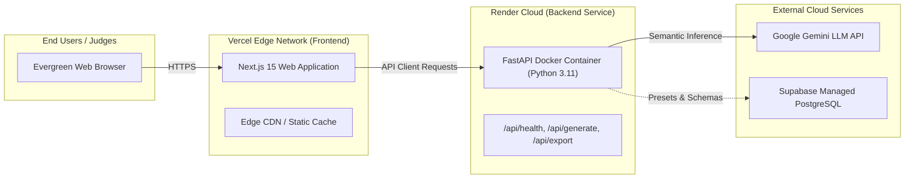

# HACKDATA V2 — DEPLOYMENT STRATEGY & RUNBOOK

> **Target Cloud Platforms:** Vercel (Frontend Next.js) + Render (Backend FastAPI Web Service) + Supabase (PostgreSQL)  
> **Deployment Architecture:** Decoupled, horizontally scalable, reproducible containerized workflow.  
> **Status:** Baseline Deployment Plan

---

## 1. Production Architecture Topology



---

## 2. Platform Allocations

### 2.1 Frontend Deployment: Vercel
- **Repository Root:** `frontend/`
- **Framework Preset:** Next.js
- **Build Command:** `npm run build`
- **Output Directory:** `.next`
- **Node Version:** Node.js 20.x
- **Environment Variables:**
  - `NEXT_PUBLIC_API_URL`: URL of the deployed Render backend (e.g. `https://hackdata-backend.onrender.com`).
  - `NEXT_PUBLIC_APP_ENV`: `production`

### 2.2 Backend Deployment: Render (Web Service)
- **Repository Root:** `backend/`
- **Environment:** Docker
- **Instance Type:** Standard / Free Web Service
- **Health Check Path:** `/api/health`
- **Port:** `8000`
- **Environment Variables:**
  - `PORT`: `8000`
  - `ENVIRONMENT`: `production`
  - `GEMINI_API_KEY`: API key for Google Gemini model inference.
  - `ALLOWED_ORIGINS`: Comma-separated CORS origins (e.g. `https://hackdata-v2.vercel.app,http://localhost:3000`).
  - `SUPABASE_URL`: (Optional) Supabase project URL.
  - `SUPABASE_KEY`: (Optional) Supabase service/anon key.

---

## 3. Container Configuration (`backend/Dockerfile`)

```dockerfile
# Multi-stage minimal production image
FROM python:3.11-slim AS builder

WORKDIR /app
COPY requirements.txt .
RUN pip install --no-cache-dir --user -r requirements.txt

FROM python:3.11-slim AS runner

WORKDIR /app
COPY --from=builder /root/.local /root/.local
COPY app/ ./app/

ENV PATH=/root/.local/bin:$PATH
ENV PYTHONUNBUFFERED=1
ENV PORT=8000

EXPOSE 8000

CMD ["uvicorn", "app.main:app", "--host", "0.0.0.0", "--port", "8000"]
```

---

## 4. Local Deployment & Run Instructions

### 4.1 Backend Local Setup
```powershell
cd backend
python -m venv .venv
.venv\Scripts\Activate.ps1
pip install -r requirements.txt
uvicorn app.main:app --reload --port 8000
```
Verify at: `http://localhost:8000/api/health`

### 4.2 Frontend Local Setup
```powershell
cd frontend
npm install
npm run dev
```
Verify at: `http://localhost:3000`

---

## 5. Production Smoke Test Protocol

Before declaring deployment complete, execute this sequential smoke test:
1. **Health Verification:** `curl -f https://<backend-host>/api/health` returns `HTTP 200` with `status: healthy`.
2. **CORS Verification:** Query backend from the Vercel domain; confirm `Access-Control-Allow-Origin` header matches.
3. **Tabular Generation Smoke Test:** Request 10 rows on `/api/generate/tabular`; verify JSON response in `< 300ms`.
4. **Relational Generation Smoke Test:** Request multi-table set; assert referential integrity validator returns `100% Valid`.
5. **Document Rendering Smoke Test:** Navigate to `Documents -> Invoices`; confirm `#INV-10432` renders cleanly.
6. **Export Download Smoke Test:** Click `Export -> CSV`; verify file downloads immediately and opens without corruption.
