# HACKDATA V2 — TASK BREAKDOWN & WORK BREAKDOWN STRUCTURE (WBS)

> **Framework:** Phased, dependency-aware sprint plan  
> **Prioritization:** P0 (Mandatory MVP) · P1 (Core Quality) · P2 (Enhancements) · P3 (Differentiators)  
> **Status:** Baseline Execution Plan

---

## 1. Execution Flow & Milestone Roadmap

```mermaid
flowchart TD
    subgraph Milestone_0 ["Phase 0: Architecture & Foundation"]
        M0_1["Finalize Data Models & Schemas"]
        M0_2["Setup Next.js & FastAPI Shells"]
    end

    subgraph Milestone_1 ["Phase 1: P0 Core Engines & Workspace"]
        M1_1["Backend Tabular Engine"]
        M1_2["Backend Relational DAG Engine"]
        M1_3["Backend Document Engine"]
        M1_4["Frontend 3-Pane Layout"]
        M1_5["Live Preview Canvas & Fast Shimmer"]
        M1_6["Export Service (CSV/JSON/SQL/PDF)"]
    end

    subgraph Milestone_2 ["Phase 2: P1 AI Layer & Privacy Controls"]
        M2_1["AI Schema Understanding & Inference"]
        M2_2["AI Realistic Content Synthesis"]
        M2_3["AI Edge-Case & Outlier Injection"]
        M2_4["Privacy Transforms (Masking/Hashing/Noise)"]
    end

    subgraph Milestone_3 ["Phase 3: Integration & P2 Polish"]
        M3_1["Natural Language Query Filtering"]
        M3_2["Regional Document Templating"]
        M3_3["End-to-End Cross-Modality Verification"]
    end

    subgraph Milestone_4 ["Phase 4: QA, Security & Deployment"]
        M4_1["Comprehensive QA & Integrity Audit"]
        M4_2["Vercel + Render Production Deployment"]
        M4_3["Live Demo Rehearsal & Verification"]
    end

    Milestone_0 --> Milestone_1
    Milestone_1 --> Milestone_2
    Milestone_2 --> Milestone_3
    Milestone_3 --> Milestone_4
```

---

## 2. Phase 0 — Foundation & Infrastructure Setup

| Task ID      | Task Description                                                                                                                                       |    Owner    |    Dependencies    | Deliverable                     |
| :----------- | :----------------------------------------------------------------------------------------------------------------------------------------------------- | :---------: | :----------------: | :------------------------------ |
| **T-P0-001** | Initialize FastAPI backend workspace with virtualenv & core dependencies (`fastapi`, `uvicorn`, `pydantic`, `numpy`, `scipy`, `faker`, `google-genai`) |   Backend   |        None        | Working `/api/health` endpoint  |
| **T-P0-002** | Initialize Next.js 15 / React 19 frontend workspace with Tailwind CSS, Lucide icons, and component primitives                                          |  Frontend   |        None        | Clean Next.js application shell |
| **T-P0-003** | Establish shared TypeScript types matching Pydantic request/response models                                                                            | Integration | T-P0-001, T-P0-002 | Type-safe API contracts         |

---

## 3. Phase 1 — P0 Mandatory Core MVP Implementation

### 3.1 Backend Core Engines (`backend/app/engine/`)

| Task ID      | Task Description                                                                                                                                                         |  Owner  |    Dependencies    | Acceptance Criteria                                               |
| :----------- | :----------------------------------------------------------------------------------------------------------------------------------------------------------------------- | :-----: | :----------------: | :---------------------------------------------------------------- |
| **T-P0-010** | **Tabular Generation Engine:** Build numeric distribution generator (normal, uniform, log-normal) and categorical generator with seed reproducibility                    | Backend |      T-P0-001      | Identical seed produces identical rows; correct mean/variance     |
| **T-P0-011** | **Relational DAG Engine:** Build dependency-ordered generator enforcing 100% foreign key integrity across Customers -> Orders -> Order Items                             | Backend |      T-P0-010      | Zero orphaned child keys; configurable 1:1, 1:N cardinalities     |
| **T-P0-012** | **Document Engine — Invoices:** Implement invoice generator with line items, tax rules, and strict total arithmetic reconciliation (`total == sum(qty * price) + tax`)   | Backend |      T-P0-010      | Generated invoices reconcile with $0.00 discrepancy               |
| **T-P0-013** | **Document Engine — Bank Statements:** Implement statement generator with realistic merchant names, credit/debit transactions, and verified running balance calculations | Backend |      T-P0-010      | `balance[i] == balance[i-1] + credit[i] - debit[i]` for every row |
| **T-P0-014** | **Export Multi-Format Engine:** Implement serialization for CSV, JSON, Relational SQL DDL+Insert dumps, and downloadable PDF-ready representations                       | Backend | T-P0-011, T-P0-012 | Valid RFC CSV, valid JSON, executable SQL scripts                 |

### 3.2 Frontend 3-Pane Workspace (`frontend/`)

| Task ID      | Task Description                                                                                                                                         |    Owner    |    Dependencies    | Acceptance Criteria                                       |
| :----------- | :------------------------------------------------------------------------------------------------------------------------------------------------------- | :---------: | :----------------: | :-------------------------------------------------------- |
| **T-P0-020** | **3-Pane Layout Shell:** Construct fixed viewport 3-column split view (Left Nav Sidebar, Center Preview Canvas, Right Config Panel) matching Slide 10    |  Frontend   |      T-P0-002      | Strict visual match with official Slide 10 mockup         |
| **T-P0-021** | **Workspace Navigation:** Implement selectable views for Tabular, Relational, and Documents (Invoices / Statements) with active teal pill styling        |  Frontend   |      T-P0-020      | Switching views updates canvas without full page reload   |
| **T-P0-022** | **Configuration Drawer:** Implement controls for Row count, Random seed (with lock/refresh button), Locale & currency selector, and Privacy rule toggles |  Frontend   |      T-P0-020      | Form controls bind to Zustand reactive state store        |
| **T-P0-023** | **Live Preview Canvas:** Implement responsive data grid for Tabular data and multi-table viewer for Relational data                                      |  Frontend   |      T-P0-021      | Renders rows matching Slide 5 table structure             |
| **T-P0-024** | **Rendered Invoice & Statement Cards:** Implement visual document components for Invoice INV-10432 and Bank Statement excerpt                            |  Frontend   |      T-P0-021      | High-fidelity visual cards matching Slide 7 and 8 layouts |
| **T-P0-025** | **Live Preview Reactivity & Debounce:** Connect config inputs to backend `/api/generate` with 150ms debounce and lightweight loading shimmer             | Integration | T-P0-010, T-P0-022 | Preview updates reactively in `<200ms` as controls adjust |
| **T-P0-026** | **Export Action Modal:** Connect primary Export button to `/api/export` with download triggers for CSV, JSON, SQL, and PDF                               | Integration | T-P0-014, T-P0-022 | Clicking export downloads valid file archive              |

---

## 4. Phase 2 — P1 AI Layer & Privacy Controls

| Task ID      | Task Description                                                                                                                                      |    Owner    | Dependencies | Acceptance Criteria                                              |
| :----------- | :---------------------------------------------------------------------------------------------------------------------------------------------------- | :---------: | :----------: | :--------------------------------------------------------------- |
| **T-P1-001** | **AI Schema Understanding:** Build LLM pipeline to ingest sample datasets/schemas and infer semantic types (e.g. email, full name, address, currency) | AI Engineer |   T-P0-010   | Automatically classifies column semantics without manual mapping |
| **T-P1-002** | **AI Realistic Content Synthesis:** Build LLM-augmented prompt generators for natural names, corporate entities, and narrative invoice line items     | AI Engineer |   T-P0-012   | Text reads naturally, avoiding repetitive placeholder strings    |
| **T-P1-003** | **AI Edge-Case & Outlier Injection:** Implement AI edge-case generator proposing nulls, boundary values, and rare patterns                            | AI Engineer |   T-P0-010   | Injects edge cases into test rows with visual highlight badge    |
| **T-P1-004** | **Privacy Controls — Masking & Hashing:** Implement regex PII masking and SHA-256 cryptographic column hashing                                        |   Backend   |   T-P0-010   | Sensitive columns properly masked/hashed when toggled            |
| **T-P1-005** | **Privacy Controls — Differential Noise:** Implement Laplace mechanism for differential privacy noise on numerical balances                           |   Backend   |   T-P0-010   | Configurable epsilon slider adds calibrated noise                |
| **T-P1-006** | **Regional Invoice Layout Templating:** Support locale-specific currency symbols, date formats, and tax rules (US Sales Tax, EU VAT)                  |  Frontend   |   T-P0-024   | Changing locale dynamically updates formatting on invoice card   |

---

## 5. Phase 3 — P2 Enhancements & Cross-Domain Polish

| Task ID      | Task Description                                                                                                           |    Owner     | Dependencies | Acceptance Criteria                                              |
| :----------- | :------------------------------------------------------------------------------------------------------------------------- | :----------: | :----------: | :--------------------------------------------------------------- |
| **T-P2-001** | **Query-Style Generation:** Implement query filter parser (e.g., _"last 90 days, balance over $500"_) for bank statements  | AI / Backend |   T-P0-013   | Generated statements adhere to specified natural language filter |
| **T-P2-002** | **N:N Relational Cardinality:** Extend relational engine to support many-to-many relationships through join tables         |   Backend    |   T-P0-011   | Products <-> Orders linked via Order Items junction records      |
| **T-P2-003** | **Interactive SQL Dump Preview:** Provide an in-browser preview tab showing generated PostgreSQL DDL and INSERT statements |   Frontend   |   T-P0-014   | Syntax-highlighted SQL copyable with one click                   |

---

## 6. Phase 4 — Testing, Verification & Production Deployment

| Task ID      | Task Description                                                                                                                  |     Owner     | Dependencies | Acceptance Criteria                             |
| :----------- | :-------------------------------------------------------------------------------------------------------------------------------- | :-----------: | :----------: | :---------------------------------------------- |
| **T-P4-001** | **Automated Integrity Test Suite:** Run unit & integration tests validating 100% referential integrity and arithmetic balance     | QA / Security | All P0 Tasks | Zero failed assertions on random seeds          |
| **T-P4-002** | **UI Compliance Audit:** Verify strict adherence to Slide 10 3-pane layout, design tokens, and responsiveness                     | QA / Frontend |   T-P0-020   | All UI-001 to UI-010 criteria PASS              |
| **T-P4-003** | **Backend Deployment on Render:** Build Docker container and deploy FastAPI service to Render Web Service                         |  Deployment   | All Backend  | Production health check returns `200 OK`        |
| **T-P4-004** | **Frontend Deployment on Vercel:** Deploy Next.js frontend to Vercel with environment variable configuration                      |  Deployment   | All Frontend | Live URL loads in `<1s` and connects to backend |
| **T-P4-005** | **Live Demo Rehearsal & Verification:** Execute the 3-minute winning demo sequence (Tabular -> Relational -> Documents -> Export) | Project Lead  |  All Tasks   | 100% demo-ready with zero errors                |
