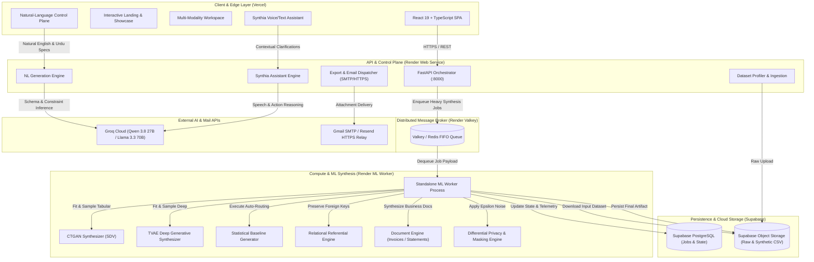
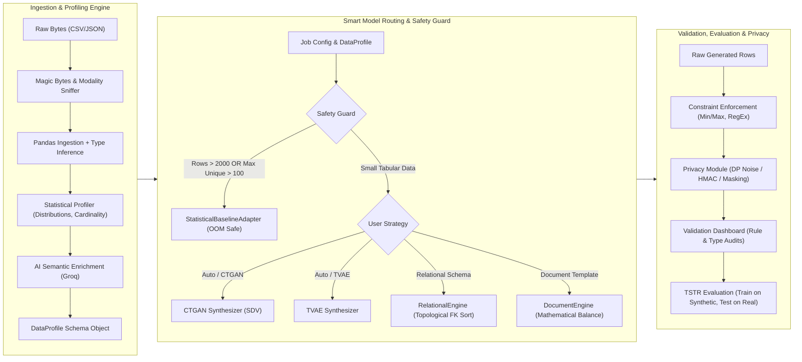
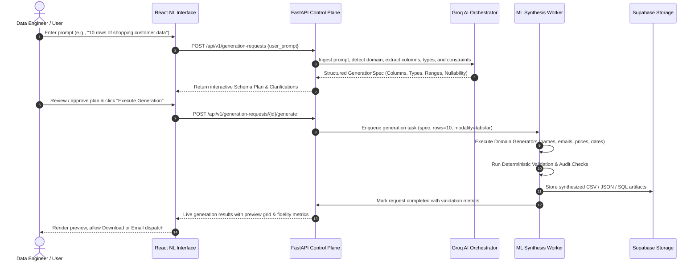
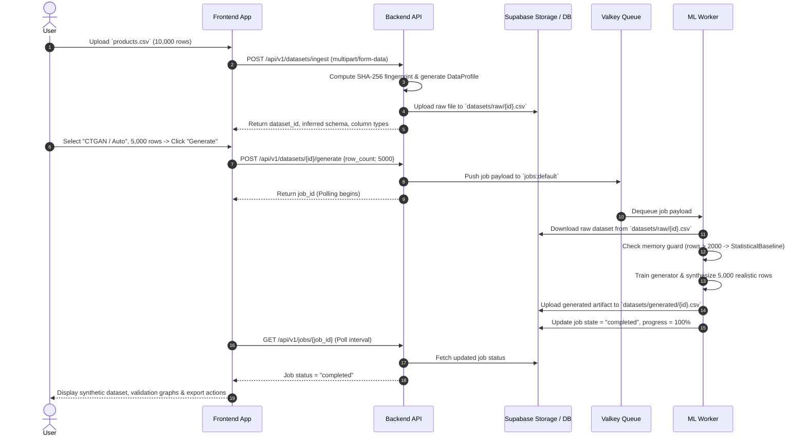
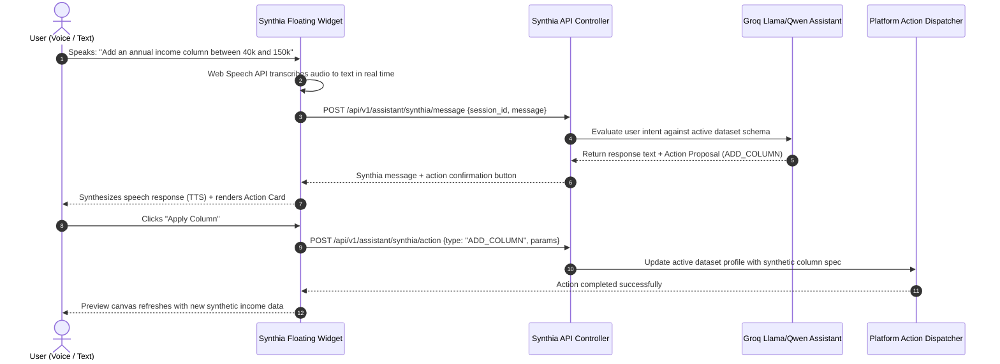

# HackData V2 — Comprehensive Architecture & Flow Diagrams

This document contains authoritative High-Level (HLD) and Low-Level (LLD) architectural diagrams for the **HackData V2 — Schema-Aware Synthetic Data Platform**. All diagrams are authored in standard Mermaid code for instant rendering and documentation compliance.

---

## 1. High-Level System Architecture (HLD)

---

## 2. Low-Level Component Architecture (LLD)

---

## 3. Natural-Language to Synthetic Data Pipeline Flow

---

## 4. Dataset Upload & Distributed Synthesis Flow

---

## 5. Synthia Real-Time Multimodal Voice & Chat Flow

